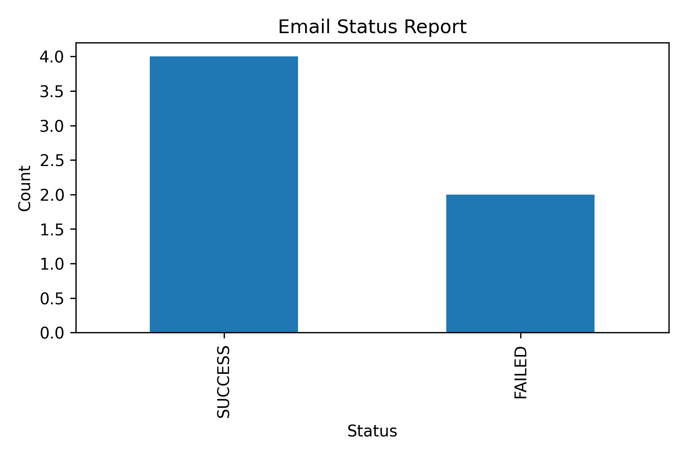
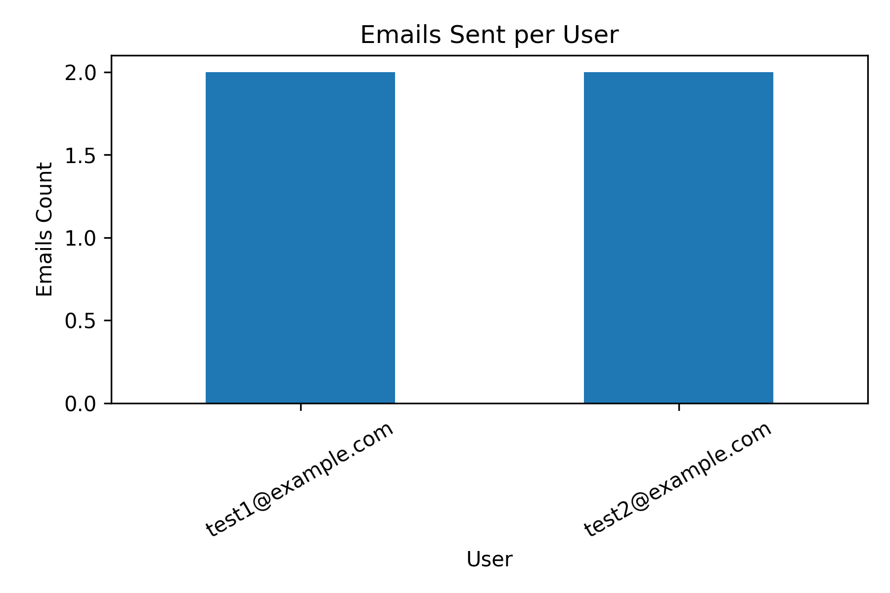
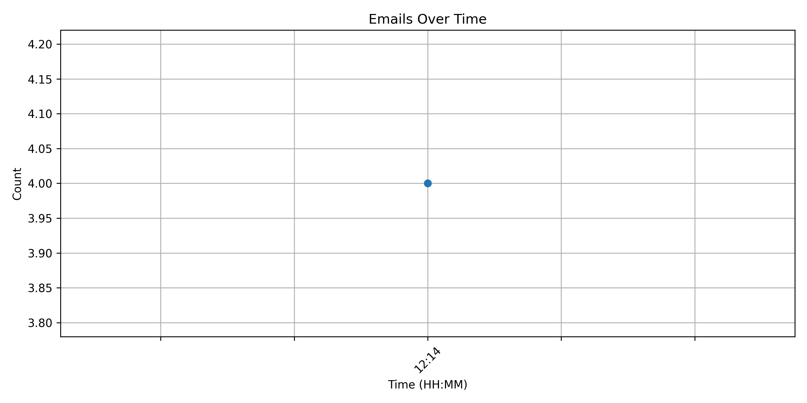
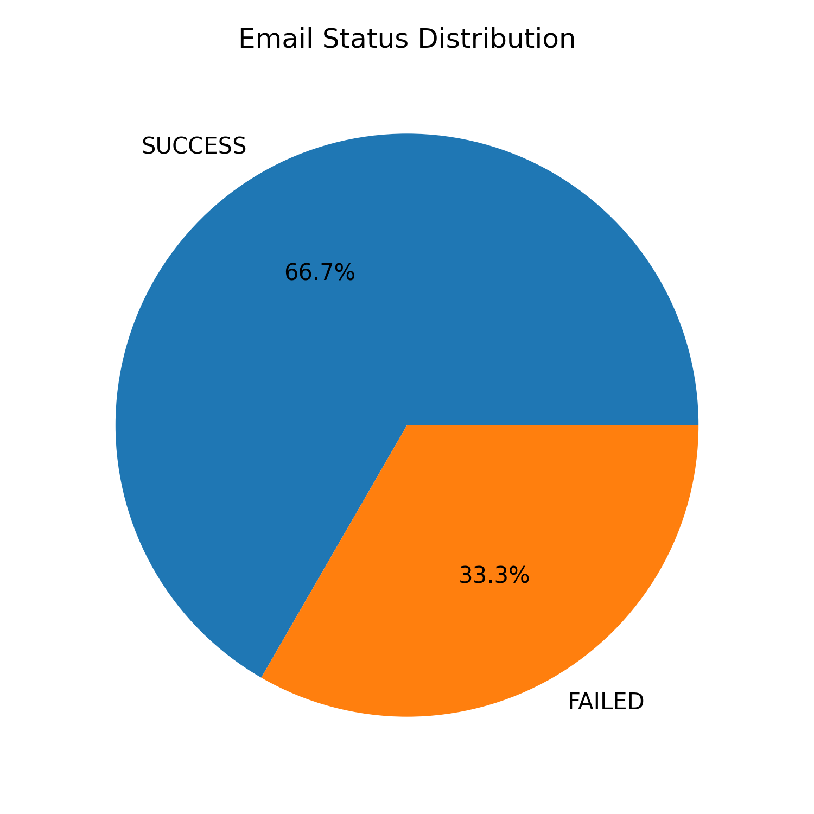

# 📧 Email Automation & Reminder System

A complete **Python-based Email Automation System** that schedules and sends personalized emails using CSV data, templates, and SMTP — with built-in analytics and auto-generated visual reports.

---

## 🚀 Overview

Manual email follow-ups and reminders are repetitive and error-prone.
This project automates:

* 📩 Sending personalized emails
* ⏰ Scheduling reminders
* 📊 Tracking email status (Success/Failure)
* 📈 Generating analytics charts automatically

---

## 🎯 Problem Statement

Organizations (HR, Sales, Trainers, Admin teams) often need to:

* Send bulk emails
* Follow up with users
* Send reminders (meetings, payments, classes)

Doing this manually leads to:

* ❌ Missed deadlines
* ❌ Human errors
* ❌ Time wastage

---

## ✅ Solution

This system automates the entire workflow:

```
CSV Data → Template → Personalization → Scheduling → Email Sending → Logging → Report → Charts
```

---

## ✨ Features

* 📂 CSV-based contact management
* 🧠 Template-based personalization (`{{name}}`, `{{message}}`)
* ⏰ Automated scheduling using Python
* 📩 Email sending via SMTP (Gmail supported)
* 🧪 Dry-run mode (safe testing without sending emails)
* 📊 Report generation (`report.csv`)
* 📈 Auto-generated charts (4 visualizations)
* 📝 Logging system for tracking

---

## 🛠️ Tech Stack

* Python 3.10
* Pandas
* smtplib (built-in)
* schedule
* matplotlib
* python-dotenv

---

## 📁 Project Structure

```
Email-Automation-Reminder-System/
│
├── data/
│   ├── contacts.csv
│   └── reminders.csv
│
├── templates/
│   └── email_template.txt
│
├── src/
│   ├── config.py
│   ├── email_service.py
│   ├── scheduler.py
│   ├── utils.py
│   └── logger.py
│
├── outputs/
│   └── report.csv
│
├── logs/
│   └── email.log
│
├── images/
│   ├── report_chart.png
│   ├── emails_per_user.png
│   ├── time_distribution.png
│   └── status_pie.png
│
├── docs/
│   └── architecture.md
│
├── main.py
├── requirements.txt
├── .env.example
├── .gitignore
└── README.md
```

---

## ⚙️ Installation

# Create virtual environment
python -m venv venv

# Activate (Windows)
venv\Scripts\activate

# Install dependencies
pip install -r requirements.txt
```

## 💻 Sample Output

```
🚀 Scheduler Started...
[DRY RUN] Sending email to test1@example.com
[DRY RUN] Sending email to test2@example.com
✅ Emails Processed, Report & 4 Images Generated
```

---

## 📸 Output Visualizations

### 📊 Email Status Report


### 👤 Emails per User


### ⏰ Emails Over Time


### 🥧 Status Distribution



## 🚀 Real-World Applications

* 📚 Class reminders
* 💰 Payment notifications
* 📅 Meeting alerts
* 📢 Marketing campaigns
* 🧾 Invoice follow-ups
* 🧑‍💼 HR onboarding emails

---

## 🔮 Future Improvements

* FastAPI backend
* Web dashboard (Streamlit / Next.js)
* Database (SQLite/PostgreSQL)
* Email tracking (open/click)
* Multi-user system
* Scheduled campaigns

---

## 🎓 Learning Outcomes

* Python automation
* Email protocols (SMTP)
* Scheduling systems
* Data processing with Pandas
* Logging & reporting
* Visualization with Matplotlib
* Real-world backend design

---

## 👩‍💻 Author

**Ananya Jain**
